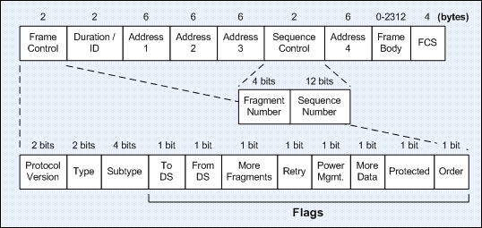

# Airkiss


## About 

[Airkiss][airkiss]是微信提出的一种无线应用层协议,主要用于给无法交互的硬件设备进行网络配置,
如(智能)插座,灯泡,飞机杯等. 其原理是将硬件设备的网卡置于监听模式(monitor mode),
又称为混杂模式(promiscuous mode), 从而获取周围的802.11无线数据帧, 俗称抓包. 
加密的无线数据中length字段是可见的,利用这个字段我们就能约定一种传输数据的协议,
从而在硬件设备初次进入环境时为其提供wifi的帐号密码等信息.
其联网方式类似于TI的[Smart Config][smartcfg].

由于微信官方的airkiss静态库调试起来很不方便,而且也无法按需要进行拓展,
因此在已公开的Airkiss协议基础上实现了一份C代码.用作研究和参考.

> 注:  
> 本例程实现的源码在[airkiss\_debugger][akdbg]以及微信(6.3.31)上测试通过, 但不保证100%兼容微信官方的静态库.  
> 如果要使用于生产环境,最好还是获取微信官方的静态库,对于不常见的硬件设备也可以申请获取对应交叉编译的版本.

具体的实现细节可以参考下列**非官方**的资料和文档:

- [Airkss技术实现方案][airkiss_doc]
- [How does TI CC3000 wifi smart config work?][smartcfg_doc]

## Build

`airkiss.h`以及`libs\libairkiss*.a`都是微信官方的airkiss头文件和静态库, `airkiss.c`则是其中一个c语言的实现,
经测试两者的功能是基本相同的.

`main.c`在Linux下进行切换wifi模式,切换信道以及抓包,实现了一个简单的airkiss上层应用.
编译过程如下:

> Linux下扫描热点需要用到`libiw-dev`.
> 操作网卡如切换信道,切换模式等需要root权限.  


```
$ sudo apt-get install libiw-dev
$ make clean
$ make
```

## Run

运行时需要关闭占用网卡的进程,如NetworkManager等:


```
$ sudo service NetworkManager stop
或者
$ sudo systemctl stop NetworkManager.service
```

运行程序,抓包和切换信道需要root权限:

```
$ sudo ./airkiss wlan1
```

其中wlan1是所选择的无线网卡, 开始运行后可以用微信公众号或者airkiss\_debugger发送wifi密码进行测试, 
如发送密码`myfuckingcomplexpasswd`,则有如下输出:

```
Scanning accesss point...
Scan success.
bssid:[bc:46:99:af:d3:f6], channel:[11], pow:[-65 dBm], essid_crc:[fe], essid:[jin123]
bssid:[f8:d1:11:f1:3f:d6], channel:[ 1], pow:[-86 dBm], essid_crc:[e3], essid:[manson]
bssid:[a4:56:02:73:bb:03], channel:[ 1], pow:[-75 dBm], essid_crc:[40], essid:[360WiFi-73BB03]
bssid:[d4:67:e7:0f:9b:51], channel:[ 1], pow:[-86 dBm], essid_crc:[00], essid:[ChinaNet-KnHF]
bssid:[c4:36:55:98:9a:75], channel:[11], pow:[-56 dBm], essid_crc:[00], essid:[]
bssid:[12:95:8e:60:f2:e4], channel:[11], pow:[-92 dBm], essid_crc:[62], essid:[TPGuest_F2E4]
bssid:[cc:81:da:43:ea:e0], channel:[ 3], pow:[-82 dBm], essid_crc:[2c], essid:[@PHICOMM_D8]
bssid:[f4:b8:a7:6c:72:39], channel:[ 3], pow:[-82 dBm], essid_crc:[72], essid:[ChinaNet-TkT4]
bssid:[bc:46:99:43:b5:c4], channel:[ 6], pow:[-91 dBm], essid_crc:[f2], essid:[TP-LINK_B5C4]
bssid:[ec:26:ca:f6:5f:ba], channel:[ 6], pow:[-89 dBm], essid_crc:[df], essid:[TP-LINK_1301]
bssid:[b0:95:8e:60:f2:e4], channel:[11], pow:[-92 dBm], essid_crc:[2c], essid:[TP-LINK_F2E4]
down iface wlan1
set iface wlan1 type to monitor
up iface wlan1
airkiss_local_context size:128
Airkiss version: V1.3
exec cmd: iw wlan1 set channel 1
exec cmd: iw wlan1 set channel 3
exec cmd: iw wlan1 set channel 6
scan all channels
exec cmd: iw wlan1 set channel 11
exec cmd: iw wlan1 set channel 1
exec cmd: iw wlan1 set channel 3
exec cmd: iw wlan1 set channel 6
scan all channels
exec cmd: iw wlan1 set channel 11
exec cmd: iw wlan1 set channel 1
exec cmd: iw wlan1 set channel 3
exec cmd: iw wlan1 set channel 6
scan all channels
exec cmd: iw wlan1 set channel 11
exec cmd: iw wlan1 set channel 1
exec cmd: iw wlan1 set channel 3
exec cmd: iw wlan1 set channel 6
scan all channels
exec cmd: iw wlan1 set channel 11
airkiss_recv_discover success
base len:78
Lock channel in 11
airkiss_process_magic_code success
total_len:29, ssid crc:fe
airkiss_process_prefix_code success
pswd_len:22, pswd_lencrc:40, need seq:6, seq map:3f
[crc:00][index:0]:6d,79,66,75; crc check error. calc crc:[00]
[crc:23][index:1]:63,6b,69,6e; seq mapped:2
[crc:0e][index:2]:67,63,6f,6d; seq mapped:6
[crc:40][index:4]:70,61,73,73; seq mapped:16
[crc:3d][index:5]:77,64,64,6a; seq mapped:36
[crc:25][index:6]:69,6e,31,32; seq mapped:36
[crc:5b][index:0]:6d,79,66,75; seq mapped:37
[crc:23][index:1]:63,6b,69,6e; seq mapped:37
[crc:0e][index:2]:67,63,6f,6d; seq mapped:37
[crc:67][index:3]:70,6c,65,78; seq mapped:3f
User data is :6d 79 66 75 63 6b 69 6e 67 63 6f 6d 70 6c 65 78 70 61 73 73 77 64 64 6a 00 00 00 00 00 00 00 00 00 
Airkiss completed.
Result:
ssid_crc:[fe]
key_len:[22]
key:[myfuckingcomplexpasswd]
random:[0x64]
Sending random to broadcast..
```

由于非官方的文档已经比较老旧,新版的airkiss流程也做了不少改变,
一个优化的地方是airkiss上层在抓包之前先扫描附近的无线热点并记录其ssid/crc以及信道,从而使得airkiss
只用在这几个信道切换抓包. 另外为了加快Airkiss进度,ssid部分不从data字段读取而只取其crc(用reserved字段记录),
上层应用将记录的ssid/crc进行对比,则可以获取目标的ssid信息并连接.连接后根据airkiss协议,
向10000端口广播random值通知发送端即可完成配置.

> 注:  
> 由于不同抓包策略会导致抓到的包格式各不相同,比如有的是带802.11头的数据帧(亦即微信官方要求的格式),  
> 有的是更底层的比如带Radiotap头的数据,更有的是不带头的纯数据(比如同一局域网内),为了彼此兼容,
> 理论上可以仅用长度来编解码. 但实践中发现,如果不对数据帧进行筛选,周围无线信号过多时会造成很大干扰,
> 从而导致无法在指定时间内完成指定数据的解码, 因此代码里规定数据为802.11数据帧, 并对其24位header进行一定程度的过滤.

802.11的帧结构如下图所示, 目前对Address1/Address2/Address3字段进行了过滤, 其它详细的字段的介绍可以参考[其他博客][80211].



## Known issue

- 暂未对wifi密码进行AES加/解密
- 热点名称为中文时显示为空

[akdbg]: http://iot.weixin.qq.com/wiki/doc/wifi/AirKissDebugger.apk
[airkiss]:http://iot.weixin.qq.com/wiki/doc/wifi/AirKissDoc.pdf
[smartcfg]:http://processors.wiki.ti.com/index.php/CC3000_Smart_Config
[airkiss_doc]:http://wenku.baidu.com/view/0e825981ad02de80d5d8409c
[airkiss_doc2]:https://www.docdroid.net/UIi8rgt/airkiss-protocol.pdf.html
[smartcfg_doc]:http://electronics.stackexchange.com/questions/61704/how-does-ti-cc3000-wifi-smart-config-work
[80211]:http://www.itcertnotes.com/2011/05/ieee-80211-frame-types.html

